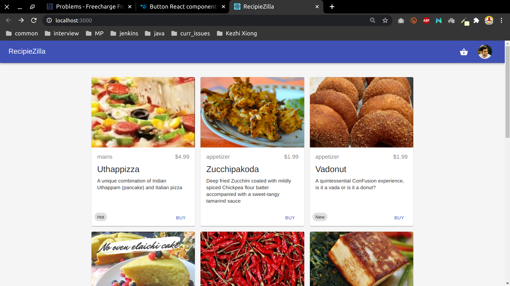
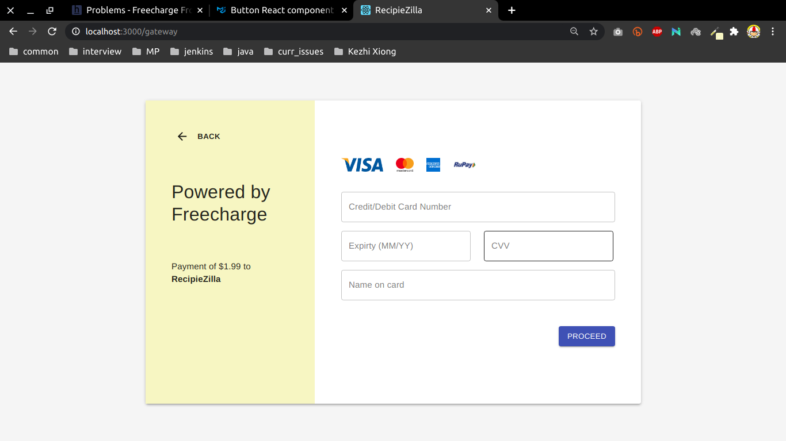
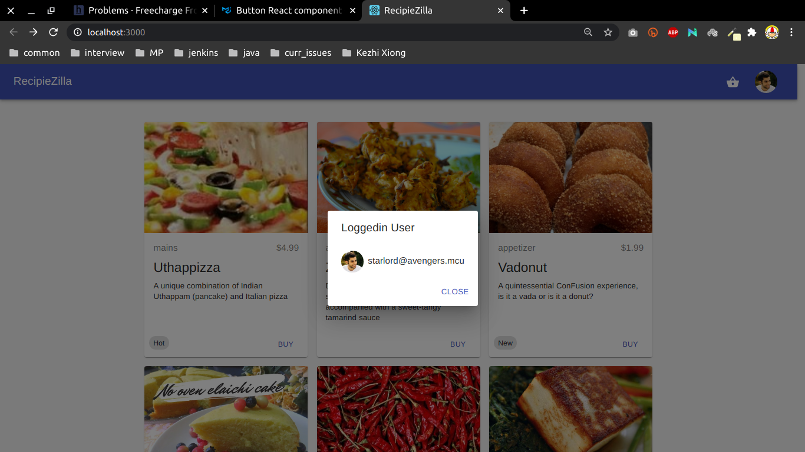

# Recipe-Zilla 

Made for freecharge hiring contest hosted in hackerearth (October 13, 2020)

### Goals:

1. Consume API provided by freecharge
1. Build a list view
1. Build a mock payment gateway

### Tech:

1. react & react hooks
1. redux
1. material design core
1. axios

### Screenshots:

